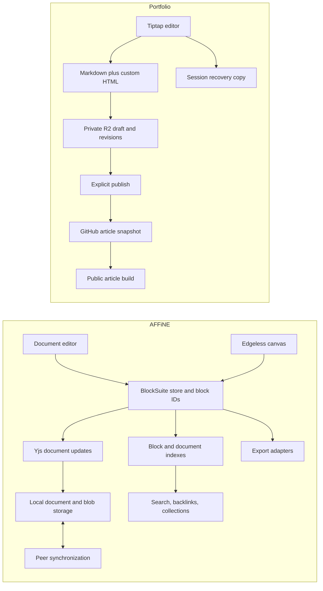

# AFFiNE source review and comparison with our writing system

Reviewed September 28, 2026. AFFiNE snapshot: `164a84ffe00e8e3df289396b6a25d9b85e0343d1`, default `canary` branch, commit dated September 25, 2026; root package version `0.27.5`. Portfolio baseline: `d153910`.

This is a source-based review, not a product demo or a claim that every AFFiNE feature works in every release. The checkout contains 10,261 tracked files. I inspected the module/block inventories and traced selected high-value implementations, models, adapters, and tests. I did not read every line, install AFFiNE's dependencies, run its application, or execute its tests. Features below are distinguished from experimental flags and recommendations. Our “present” labels mean implementation found in code, not fresh browser acceptance testing.

**Recommendation:** keep our publishing system and Tiptap editor. Borrow AFFiNE's block identity, interaction ownership, linked-document workflows, storage state separation, and testing discipline. A full BlockSuite migration would replace substantial parts of editing, persistence, rendering, and security; it is disproportionate unless a collaborative canvas workspace becomes the actual product goal.

**What AFFiNE is structurally**

AFFiNE is a knowledge workspace with document and spatial editing. Its editor is BlockSuite, rather than Tiptap. BlockSuite models blocks separately from their renderers and interaction services. Blocks have identities, schemas, properties, and parent/child relationships. The store uses Yjs, while the application supplies workspace storage, indexing, permissions, navigation, and optional cloud services. The editor code includes Lit components, signals, dependency injection, and a service layer; it is not a collection of React components we can paste into our app. [Store][A], [note model][AC], [workspace engine][Q].

Our durable draft body is a Markdown string. The live editor has a ProseMirror tree, but we do not currently persist that tree as an independent, versioned editor document. A document ID survives a slug change; equivalent durable IDs for ordinary blocks are not present in the editor extensions inspected. This is the main dependency behind several attractive AFFiNE features.

**Feature inventory and comparison**

“Partial” means a related capability exists with a materially narrower scope. “Not found” means no corresponding implementation was found in the inspected application, not proof that no similarly named helper exists anywhere.

| Area | AFFiNE capability found in source | Our implementation | Assessment / fit |
| --- | --- | --- | --- |
| Writing | Paragraphs, headings, lists, code, dividers, callouts | Block registry, slash menu, Tiptap extensions | Present; improve reliability before adding more block types. [Blocks][AU] |
| Writing | Checklists and nested content | Task lists and nested task items | Present at writing level; not a task-management database. [Blocks][AU] |
| Writing | Selection formatting and contextual commands | Bubble toolbar, color/font/opacity controls, command palette | Present; behavior parity remains unverified. [Editor modules][AV] |
| Writing | Link form with display text and address | Shared LinkHover editor and replace-link transaction | Present after latest fix. AFFiNE has a useful lifecycle pattern. [Link popup][I] |
| Writing | Image resizing, captions, previews | Resize handles, numeric width, alt/caption fields, public zoom | Present; our Markdown width persistence must be retained. [Image model][E], [resize][F] |
| Writing | Dedicated attachments and previews | Image/video/audio pipeline; no general attachment library found | Partial. PDF attachment cards could be valuable. [Blocks][AU], [peek targets][M] |
| Writing | Bookmarks and provider-specific embed blocks | Selected social/video embeds and media nodes | Partial; AFFiNE includes Figma, GitHub, Loom, YouTube, HTML and iframe block packages. [Blocks][AU] |
| Writing | LaTeX block and diagram/document-rendering modules | No corresponding math/Mermaid/Typst editing found | Not found. Useful for technical articles; evaluate separately. [Blocks][AU], [modules][AV] |
| Writing | Inline document/date/person menu integration | @ dates, optional time, page references and child-page creation | Partial; no workspace-member mentions/permission grants. [At-menu][Z] |
| Writing | Emoji/icons and document display metadata | Emoji suggestions, page/heading icons, inline logo/text | Present for our publishing use; not an exact node-for-node match. [Modules][AV] |
| Selection | Block selections represented by stable block IDs | ProseMirror NodeRangeSelection and top-level marquee | Partial; our depth-0 selection is narrower. [Selection][B], [helper][C] |
| Selection | Multi-block movement, nested selection/drag scenarios | Batch delete, duplicate, movement and drag support | Present in narrower form; nested and scrolling cases need browser tests. [Drag tests][AR], [selection tests][AQ] |
| Selection | Cross-document drag/copy import with ID remapping | No equivalent structured cross-document transfer found | Not found. Good future foundation for reusable blocks. [ID middleware][D] |
| Navigation | Page links and richer reference parameters | Stable page-ID mentions and parentId | Partial: page links exist; durable block references do not. [Peek reference shape][M] |
| Navigation | Backlinks with source block/context | No backlink index/panel found | High-value addition. [Backlinks][K] |
| Navigation | Quick page, image and attachment peek views | Article preview sheet and image zoom | Partial: no linked-page research peek while writing. [Peek view][M] |
| Navigation | Synced document embeds | Mentions navigate to another page | Not found; a mention is not an embedded live document. [Synced doc][N] |
| Navigation | Split views and workbench navigation | Single editing page plus preview panels | Partial; no multi-document split workbench. [Split-view types][AB] |
| Navigation | Find-in-page and quick search modules | Find/replace, command palette, cross-page phrase search | Present at basic level. [Modules][AV] |
| Search | Indexed block hits, scores and highlights | On-request substring search over title/dek/normalized body | Partial; no persistent block index or stable block-hit target. [Search service][L] |
| Organization | Favorites, tags, trash, workspace navigation | Pinned posts, tags, trash, status filters | Partial overlap; our taxonomy is publication-oriented. [Modules][AV] |
| Organization | Saved collections using rules and manual inclusion | Post filters and tag pages | Not found as persistent, reusable rule sets. [Collections][U] |
| Organization | Custom workspace properties with typed filters | Fixed post metadata fields | Not found as user-defined properties. [Property types][W] |
| Organization | Filtering, sorting and grouping | Basic post-list sorting/filtering | Partial; AFFiNE uses reusable rule definitions. [Rules][V] |
| Organization | User-authored document templates | Six built-in template definitions and duplication | Partial; no editable template library found. [Template duplication][Y] |
| Organization | Daily journals with reusable templates | Date mentions and a “Today I learned” starter | Not found as date-indexed journal workflow. [Journal service][X] |
| Databases | Database blocks with cells, columns and view definitions | Basic Tiptap table; resizing disabled in TableKit config | Not equivalent. [Database model][R] |
| Databases | Table, Kanban and calendar view presets | No database views found | Not found. These three are explicitly registered. [View presets][S] |
| Databases | Checkbox/date/image/number/text/select/multi-select/progress properties | Ordinary table cells | Not found as typed properties. [Property presets][T] |
| Canvas | Document and edgeless views of shared content | Linear writing editor and reader | Not found; major architectural expansion. [Note display model][AC] |
| Canvas | Shapes, connectors, brush, groups, text and pointers | No canvas editing | Not found. [Graphics packages][AD] |
| Canvas | Mind maps and layout-specific editing | No mind-map editor | Not found; optional planning tool, not needed for article publishing. [Graphics packages][AD] |
| Canvas | Frames and spatial content blocks | No equivalent | Not found. [Blocks][AU] |
| Canvas | Geometry, zoom and element selection alongside block content | Responsive article layout | Different problem; do not graft canvas geometry into ordinary prose. [Note model][AC], [drag filtering][AZ] |
| Persistence | Local-first document storage | SessionStorage recovery plus remote autosave | Partial recovery, not a persistent local workspace. [Local engine][Q] |
| Persistence | Separate local-load/update and remote-sync states | Saved/unsaved/offline/error, plus deployment indicator | Partial; a clearer state model would improve trust. [Doc frontend][O] |
| Persistence | Yjs update persistence and peer synchronization | Version checks and 2.5-second pulse polling | Not real-time co-editing. Installed collaboration packages are not wired into Editor.tsx. [Sync][P] |
| Persistence | Awareness/remote-selection infrastructure | Public visitor cursor room | Different feature; visitor cursors do not synchronize editor content. [nbstore][O], [editor modules][AV] |
| Persistence | Page history and backup recovery components | R2 revisions, word diff and restore, Git publication history | Present for revisions; desktop workspace backup differs. [History UI][AY], [backup][AN] |
| Sharing | Workspace/document action permissions | Cloudflare Access JWT and administrator email allowlist | Different scope; no per-document collaborator roles. [Permission actions][AK] |
| Sharing | Sharing settings and expiring invitation state | Public article publishing; no workspace invites found | Partial public output, not collaborative sharing. [Share settings][AM] |
| Review | Comments, replies, resolution, mentions, attachments, selection context | No inline review comments found | High value if editorial review is needed. [Comment types][AA] |
| Review | Notification modules | Save toasts and session-expiry UI | Not an editorial notification inbox. [Modules][AV] |
| Import/export | Markdown/HTML and format-specific import transformers | Markdown/rich paste and Markdown publication/export paths | Partial; no full workspace migration importer found. [Transformers][AI] |
| Import/export | Notion HTML, Obsidian, Bear, DOCX, ZIP and PDF transformer source | No comparable multi-format import suite found | Source present; each format needs separate compatibility verification. [Transformers][AI] |
| Import/export | Print/export UI and PDF implementation | Existing article rendering/Markdown workflow | Partial; newer pdfmake export is explicitly experimental/default-off. [Export UI][AX], [flags][AG] |
| Capture | Clipper/share import planning with stable IDs | Paste links/media into current draft | Partial; no dedicated capture inbox. [Share plan][AH] |
| Integrations | Readwise and calendar integrations | No equivalent found | Potential research benefit, with extra auth/background-job work. [Integration registration][AJ] |
| AI | Selection-aware streaming actions | No writing assistant found | Optional; large feature/cost/security surface. [Action handler][AE] |
| AI | Mind-map/slides/image/prototype action identifiers | No equivalent found | Source support, not a guarantee of enabled entitlements or configured providers. [Action constants][AF] |
| Platforms | Web, Electron, iOS, Android/mobile app source | Responsive web admin and public website | Different distribution scope. [App packages][AW] |
| Platforms | Disk Markdown synchronization | Git-based public article snapshots | Different workflow; AFFiNE disk sync is default-off and desktop/canary-configurable. [Flags][AG] |
| Extensibility | Internal block schemas, services, adapters and extension registries | Tiptap extensions plus central command registry | Both extensible; incompatible extension/component contracts. [Store][A], [blocks][AU] |
| Quality | Browser scenarios for image drag/undo, link forms, selection/scroll and nested drag | 43 automated tests at last implementation check; browser flows not verified | The highest-priority practice to adopt. [Image tests][AO], [link tests][AP], [selection tests][AQ] |

I did not establish a complete formula/rollup/relational-database feature set, a production plugin marketplace, or universal offline availability of cloud features. Do not infer them from “Notion alternative,” folder names, or the existence of a service interface. Mobile database editing is explicitly default-off in this snapshot. Feature flags, permission checks, platform differences and AI entitlements matter. [Flags][AG].

**Low-level implementations worth learning from**

**1. Model data survives a view change.** An image's width, height, source ID, caption and geometry are properties in its block schema. A note declares its display mode and spatial properties. Views interpret those models; document mode and canvas mode are not unrelated copies of the same text. Our immediate lesson is smaller: make image sizing, heading icons, date values and future block IDs durable data with explicit serialization contracts. Do not depend on an element's current style as the saved state. [Image schema][E], [note schema][AC].

For us, a future versioned draft could carry an `editorDocument` JSON tree with durable block IDs while keeping Markdown as a derived publication/export format. That is a proposal, not an implemented migration. We must choose one canonical draft representation, define how external Markdown edits enter it, and never silently maintain two independently editable truths.

**2. Resizing has a temporary phase and a commit boundary.** `ImageResizeManager` measures the image center, derives a new width from the active left/right handle, clamps it between a minimum and the available component width, preserves the natural image ratio, and previews width through requestAnimationFrame. On release it calls `captureSync()` and writes width/height back to the model, dividing viewport measurements by canvas zoom. This separates a gesture preview from an undoable model edit. [Resize manager][F].

Our resize code already has transient dragging and a final attribute commit. The valuable improvements are explicit invariants: an unrelated transaction must not reset an in-progress drag; one gesture should undo as one operation; zoomed/embedded previews must not save screen-scaled pixels; numeric input and drag must reach the same persistence path. The latest changes address part of that, but real pointer tests remain necessary.

**3. Export is not persistence.** AFFiNE's Markdown image adapter produces a standard image node with URL, title and alt, without exporting width/height. Its HTML adapter separately includes saved dimensions. Therefore “AFFiNE supports resizing” does not imply “its Markdown export preserves resizing.” Our custom sized-image HTML-in-Markdown representation solves a requirement their Markdown exporter does not satisfy. Keep our round-trip tests rather than replacing our exporter wholesale. [Markdown adapter][G], [HTML adapter][H].

This should become a feature checklist for every new node: editor JSON → saved draft → reopened editor → published Markdown → sanitized public HTML. Also test clipboard import, undo, duplication and old-draft compatibility. A renderer-only unit test misses failures earlier in the chain.

**4. Link editing owns its interaction lifecycle.** AFFiNE's popup receives a specific inline range and an AbortController; it is mounted outside the transient text UI. Confirmation validates the range and URL. Edit mode changes both label and link, restores the inline selection, and closes explicitly. It stops editor-level clipboard/key events from interfering with form input. Floating UI anchors to the range and updates placement, including a mock visual selection while focus is inside the form. [Popup][I], [popup mounting][J].

Our new shared link form addresses immediate dismissal and text/address editing. Further improvements worth adapting are a mapped selection bookmark instead of fixed positions, range validity checks across external edits, a retained visual selection, reliable focus return, and placement tied to an anchor rather than a one-time coordinate. Implement those with our existing React/Base UI/ProseMirror contracts.

**5. Block identity makes multi-selection useful beyond deletion.** Block selections serialize a block ID rather than a screen rectangle. The drag helper resolves selected model IDs to current views, and treats text, block and canvas surface selections as distinct types. Thus rendering can change without redefining the content being selected. Cross-document import generates new IDs and remaps database cell references. Graphics filtering additionally accounts for groups and connector endpoints. [Block selection][B], [selection helper][C], [ID remapping][D], [graphics filtering][AZ].

Our marquee currently maps intersecting top-level rectangles into NodeRangeSelection. That is useful, but not the same as arbitrary nested/disjoint block selection or persistent references. Before adding “move these blocks to another page,” define identity, normalization of parent/child selection, target validation, copy-versus-move semantics, and one-operation undo. Do not make DOM order or heading text the permanent identity.

**6. Backlinks and search share an index.** AFFiNE's search service queries block content, boosts page-flavour hits, groups results by document and requests highlighted hits with block IDs. Backlinks query the same index on `refDocId`, grouping source documents and returning source block/context fields. The backlink entity also distinguishes loading, error, local and remote retrieval, with specific remote-to-local fallback cases. [Search][L], [backlinks][K].

Our current search normalizes Markdown and does case-insensitive substring matching over loaded drafts/live posts. It is reasonable for a small site but re-reads and scans content on each request; it has no durable block target. First add an incremental document/link index at save/publish time. Backlinks can initially use existing page IDs without a complete editor migration. Add block IDs when exact passage linking becomes a requirement. Private draft indexes must never be served through public search.

**7. Peek views preserve the writing context.** AFFiNE represents a peek target as a typed object: document, image list, attachment, or another supported item. Document references can carry block IDs, database row IDs, mode and canvas viewport. This is a reusable navigation contract, not an ad hoc tooltip for every block. [Peek entity][M].

A good first version for us: clicking a page mention offers “Preview” and “Open”; preview opens a side panel with title, excerpt, updated date and a jump action, while keeping the original cursor and scroll position. On mobile use a sheet. Start read-only; editing two documents at once adds dirty-state, keyboard-routing and recovery complexity.

**8. Synced embeds need cycle and exposure rules.** AFFiNE creates nested preview editors for referenced documents, uses readonly stores for the embedded view, tracks ancestry cycles, and limits deeper nesting to a card-only presentation. It also manages observers and view disposal. A plain page mention does none of that. [Synced document component][N].

For a blog, blindly publishing live private references is unsafe and surprising. A better first adaptation is “Insert excerpt from page” with source attribution and an explicit snapshot at publication. A later linked block could track its source and offer “Update excerpt,” with cycle detection, permission checks and clear handling for deleted/private sources. This snapshot policy is our proposed adaptation, not a claim about AFFiNE's publishing behavior.

**9. Local save and cloud sync are different facts.** The local engine selects IndexedDB storage for web and SQLite-backed options on desktop, with separate document/blob/indexer and sync stores. The frontend maintains load/save/apply jobs over Yjs updates. It tracks ready/loaded/updating separately from synced/retrying/error. The sync layer aggregates peer states and exposes per-document synchronization and prioritization. [Engine][Q], [frontend][O], [sync][P].

We save a recovery copy to sessionStorage and retry failed remote saves. That is not durable offline-first editing across browser restarts. The most useful incremental change is an IndexedDB draft journal with explicit local-write success, pending remote write, remote version and retry state. Keep Cloudflare expiry enforcement intact; reauthentication should resume queued work after conflict checking, not bypass authorization. Only implement CRDT co-editing if simultaneous editing is a real requirement.

**10. Databases and collections solve different problems.** The database schema persists views, columns and cells. Its data-view packages register table, Kanban and calendar views and typed cell presets. Collections, separately, derive document membership from rules plus a manual allow-list and exclude trash/empty journals. Workspace property types support reusable filter operators. [Database][R], [view presets][S], [property presets][T], [collections][U], [property types][W].

For us, saved collections are much cheaper and more useful initially: “Unpublished AI essays,” “Needs review,” “Recently updated notes,” or “Research for article X.” Later an editorial board can use our document metadata as cards. That does not require embedding a full database inside the article body. Do not call our current simple table a database.

**11. Templates and capture can remove repetitive work.** Journal creation chooses a journal template, otherwise an enabled default page template, then records the journal date. Template duplication creates a new document and removes identity/template/journal metadata that should not be inherited. Clipper planning derives stable block IDs from an import-attempt ID and validates existing block flavour/parent before reconciliation, making retry behavior explicit. [Journals][X], [document duplication][Y], [share import plan][AH].

Our useful adaptations: save an existing draft as a reusable template; add a private research inbox; capture URL, selected quote, source title and timestamp together. Store an idempotency key so a retry cannot duplicate the same capture. A daily research note is optional and should remain separate from the public article list.

**12. Review comments need stable anchors and a separate lifecycle.** AFFiNE's comment types include resolved state, replies, mentions, attachments, document snapshots and selected-content context. That is much richer than placing a comment string on an article. [Comment types][AA].

For our single-author workflow, private editorial notes could be enough initially. If collaborators are added, model permissions, authorship, replies, resolution and anchor movement. A deleted target must leave an intelligible orphaned comment rather than attach it to unrelated text. Never let internal review notes leak into the public Markdown export.

**13. AI uses editor context and explicit result handling.** The action handler gathers selected text/images and streams results with abort/error handling. Action constants distinguish which outputs can be copied, inserted or replaced; images, mind maps and slides do not all follow the same text insertion path. [Action handler][AE], [action classifications][AF].

If added here, begin with opt-in selected-text rewriting, outline suggestions or source-linked research summaries, previewed before insertion. Keep private drafts out of requests unless explicitly chosen. Cancellation, content length limits, server-side credentials, permission checks and usage bounds belong in the implementation. Reproducing AFFiNE's multimodal service stack is not a small toolbar feature.

**14. Browser regressions are part of the implementation.** AFFiNE's image tests drag both sides and verify undo/redo dimensions. Its link test moves the pointer away, opens editing, traverses inputs by Tab and changes text plus URL. Selection tests cover wheel scrolling, scrollbar interaction, viewport changes, indentation and editor padding. These are directly relevant to the bugs we have been fixing. [Image tests][AO], [link tests][AP], [selection tests][AQ].

Our current Node tests cover transactions, serialization and rendering logic, but they cannot prove portal focus, pointer capture, scroll positioning, native color picker behavior or touch interaction. The next confidence improvement is a small authorized browser acceptance suite covering those paths, not another assertion that source presence means the UI is fixed. No browser automation was run during this research.

**What to adapt first**

The following ordering is my recommendation for this portfolio, not AFFiNE's own roadmap. Size is relative engineering scope, not a delivery estimate.

| Order | Work | Why it matters here | Scope / prerequisite |
| --- | --- | --- | --- |
| 1 | Editor interaction regression suite | Covers the repeated resize/link/menu/selection failures | Small–medium; browser execution must be available and authorized |
| 2 | Backlinks with source snippets | Turns @page links into useful research navigation | Medium; index existing page references, respect draft/public boundaries |
| 3 | Linked-page peek sheet | Check a source without losing the current writing position | Small–medium; reuse mention IDs and existing Sheet |
| 4 | IndexedDB draft recovery and truthful save states | Protect work through browser restarts, outages and login expiry | Medium; queue writes, handle stale bases and recovery conflicts |
| 5 | Saved collections | Organize research and publication queues without a database rewrite | Medium; persist rules over existing metadata |
| 6 | User-defined templates and a capture inbox | Reduces repeated setup and lost research sources | Medium; safe copying and idempotent import |
| 7 | Versioned editor JSON and durable block IDs | Foundation for exact block links, comments and reuse | Large; migration, compatibility and export contract required |
| 8 | Block links, private review notes, extract-to-page | Adds useful block-level workflows | Medium–large after IDs; transactional cross-page operations |
| 9 | Reusable excerpts with publication snapshots | Reuse content without accidental live/private changes | Medium–large; dependencies, cycles, permissions and stale-source handling |
| 10 | Editorial board/calendar over post metadata | Helps if the writing backlog grows | Medium; preferable before embedded databases |
| 11 | Multi-user CRDT editing | Valuable only with actual simultaneous authors | Large; auth, persistence, awareness, conflict and recovery model |
| 12 | Canvas/mind maps or full embedded databases | A different product direction | Very large; prototype in isolation before committing to replacement |

The best “creative” bundle is **a research companion beside the editor**: linked-page peek, incoming backlinks, source captures and reusable excerpts. It supports writing immediately and builds on the references, metadata and preview panels we already have.

**A concrete implementation shape for our project**

Keep `cms/format.ts` as the explicit boundary. If structured drafts are introduced, add a schema version and an optional versioned editor document through a migration that preserves existing Markdown. Initially migrate on opening/saving a draft, with a reversible backup and compatibility checks. Decide how Markdown edited directly in GitHub reconciles with structured drafts; compare content/version hashes and require a visible conflict decision instead of silently overwriting either.

Keep public output deterministic. Publishing should validate the draft, resolve only allowed public references, snapshot reusable excerpts, serialize the supported representation and pass it through the existing sanitizer/renderer. The blog need not ship BlockSuite, a Yjs store or the entire admin bundle.

Reuse `registry.ts` and `commands.tsx` for actions such as “Copy block link,” “Preview referenced page,” and “Extract to draft.” Prefer a shared action implementation across slash menus, block menus and keyboard commands. A shared popover/selection session should capture a target, map it through transactions, own focus and cleanup, and commit once.

Build document backlinks first with the page IDs already in `cms/mentions.ts`. Update an outgoing-reference set when a draft is saved; maintain reverse references or query a document index. Keep draft and published indexes distinct. A public backlink may include only published, public targets and sources.

A structured-block future should define these invariants before UI work: IDs persist on edits/reordering, duplication generates new IDs, cross-page moves update ownership, imported collisions are remapped, unsupported nodes have a fallback, and every custom attribute has a tested publication representation.

**What we should retain from our existing system**

Our deliberate draft → publish → Git snapshot → public site flow is appropriate for a personal publication. It provides a clear distinction between editing and going live. Slug redirects, scheduled initial publication, custom share metadata, author fields, public tag descriptions, feed/sitemap output, public TOC/cursors, image optimization, inline logos, per-page typography and exact updated timestamps serve this use case directly. AFFiNE's broader workspace feature count is not a reason to discard these.

The security model should follow the actual scope. Our admin verifies Cloudflare JWTs and an administrator allowlist; AFFiNE's permission layer has separate workspace/document actions and delegates decisions through its backend runtime. If we add collaborators, copy the principle of server-side per-resource authorization, not its whole backend implementation. [Permission action map][AK], [service][AL]. This comparison is not a new security audit of either product.

**Code reuse boundaries**

| Candidate | Recommendation |
| --- | --- |
| Small UI-independent algorithms and test scenarios in frontend/BlockSuite | Good candidates to study or adapt after exact-file/license review; retain required notices if copying substantial code |
| Image resize state machine | Adapt the phases and invariants to our Tiptap node view; do not copy canvas-only dependencies |
| Link popup lifecycle and selection anchoring | Reimplement with our existing stack; Lit component code is not drop-in React |
| Backlink/search result shapes | Adapt the contract; build a small index suited to our storage and volume |
| Collection rules and capture idempotency | Strong conceptual reuse with modest integration cost |
| Full BlockSuite editor | Only for a separately tested migration/prototype with content conversion and bundle/performance evaluation |
| AFFiNE backend/native code | Do not assume MIT; inspect the applicable license and edition boundaries first |
| AFFiNE Markdown image exporter | Do not substitute it for our sized-image serializer; its output drops dimensions |

The root license assigns most content outside specified exceptions to MIT, with notice preservation requirements. It explicitly routes `packages/backend` and `packages/common/native` through the backend license. That file describes an Enterprise Edition license with a Community Edition/client-side MPL-2.0 distinction. This is a repository-specific reuse boundary, not a blanket statement that every AFFiNE file is freely reusable under MIT or that every self-hosted installation requires a paid license. Confirm the exact files/edition before any code extraction. [Root license][AS], [backend license][AT].

**Verification and limits**

This research changed no application code and copied no AFFiNE implementation into the product. The reference checkout is in ignored `.audit/affine-source`. Repository code and feature registrations support the comparisons above; runtime availability, plan entitlement and every client/platform were not verified. AFFiNE's tests were inspected, not executed. Our previous 43 passing tests/build are historical evidence for our last implementation commit, not a fresh test run for this report.

The next best action is a focused improvement batch: interaction acceptance tests, page peek, backlinks and durable recovery. Stabilize those before introducing block-level reuse or replacing the content model.

[A]: https://github.com/toeverything/AFFiNE/blob/164a84ffe00e8e3df289396b6a25d9b85e0343d1/blocksuite/framework/store/src/model/store/store.ts
[B]: https://github.com/toeverything/AFFiNE/blob/164a84ffe00e8e3df289396b6a25d9b85e0343d1/blocksuite/framework/std/src/selection/block.ts
[C]: https://github.com/toeverything/AFFiNE/blob/164a84ffe00e8e3df289396b6a25d9b85e0343d1/blocksuite/affine/widgets/drag-handle/src/helpers/selection-helper.ts
[D]: https://github.com/toeverything/AFFiNE/blob/164a84ffe00e8e3df289396b6a25d9b85e0343d1/blocksuite/affine/widgets/drag-handle/src/middleware/new-id-cross-doc.ts
[E]: https://github.com/toeverything/AFFiNE/blob/164a84ffe00e8e3df289396b6a25d9b85e0343d1/blocksuite/affine/model/src/blocks/image/image-model.ts
[F]: https://github.com/toeverything/AFFiNE/blob/164a84ffe00e8e3df289396b6a25d9b85e0343d1/blocksuite/affine/blocks/image/src/image-resize-manager.ts
[G]: https://github.com/toeverything/AFFiNE/blob/164a84ffe00e8e3df289396b6a25d9b85e0343d1/blocksuite/affine/blocks/image/src/adapters/markdown.ts
[H]: https://github.com/toeverything/AFFiNE/blob/164a84ffe00e8e3df289396b6a25d9b85e0343d1/blocksuite/affine/blocks/image/src/adapters/html.ts
[I]: https://github.com/toeverything/AFFiNE/blob/164a84ffe00e8e3df289396b6a25d9b85e0343d1/blocksuite/affine/inlines/link/src/link-node/link-popup/link-popup.ts
[J]: https://github.com/toeverything/AFFiNE/blob/164a84ffe00e8e3df289396b6a25d9b85e0343d1/blocksuite/affine/inlines/link/src/link-node/link-popup/toggle-link-popup.ts
[K]: https://github.com/toeverything/AFFiNE/blob/164a84ffe00e8e3df289396b6a25d9b85e0343d1/packages/frontend/core/src/modules/doc-link/entities/doc-backlinks.ts
[L]: https://github.com/toeverything/AFFiNE/blob/164a84ffe00e8e3df289396b6a25d9b85e0343d1/packages/frontend/core/src/modules/docs-search/services/docs-search.ts
[M]: https://github.com/toeverything/AFFiNE/blob/164a84ffe00e8e3df289396b6a25d9b85e0343d1/packages/frontend/core/src/modules/peek-view/entities/peek-view.ts
[N]: https://github.com/toeverything/AFFiNE/blob/164a84ffe00e8e3df289396b6a25d9b85e0343d1/blocksuite/affine/blocks/embed-doc/src/embed-synced-doc-block/embed-synced-doc-block.ts
[O]: https://github.com/toeverything/AFFiNE/blob/164a84ffe00e8e3df289396b6a25d9b85e0343d1/packages/common/nbstore/src/frontend/doc.ts
[P]: https://github.com/toeverything/AFFiNE/blob/164a84ffe00e8e3df289396b6a25d9b85e0343d1/packages/common/nbstore/src/sync/doc/index.ts
[Q]: https://github.com/toeverything/AFFiNE/blob/164a84ffe00e8e3df289396b6a25d9b85e0343d1/packages/frontend/core/src/modules/workspace-engine/impls/local.ts
[R]: https://github.com/toeverything/AFFiNE/blob/164a84ffe00e8e3df289396b6a25d9b85e0343d1/blocksuite/affine/model/src/blocks/database/database-model.ts
[S]: https://github.com/toeverything/AFFiNE/blob/164a84ffe00e8e3df289396b6a25d9b85e0343d1/blocksuite/affine/data-view/src/view-presets/index.ts
[T]: https://github.com/toeverything/AFFiNE/tree/164a84ffe00e8e3df289396b6a25d9b85e0343d1/blocksuite/affine/data-view/src/property-presets
[U]: https://github.com/toeverything/AFFiNE/blob/164a84ffe00e8e3df289396b6a25d9b85e0343d1/packages/frontend/core/src/modules/collection/entities/collection.ts
[V]: https://github.com/toeverything/AFFiNE/blob/164a84ffe00e8e3df289396b6a25d9b85e0343d1/packages/frontend/core/src/modules/collection-rules/types.ts
[W]: https://github.com/toeverything/AFFiNE/blob/164a84ffe00e8e3df289396b6a25d9b85e0343d1/packages/frontend/core/src/modules/workspace-property/types.ts
[X]: https://github.com/toeverything/AFFiNE/blob/164a84ffe00e8e3df289396b6a25d9b85e0343d1/packages/frontend/core/src/modules/journal/services/journal.ts
[Y]: https://github.com/toeverything/AFFiNE/blob/164a84ffe00e8e3df289396b6a25d9b85e0343d1/packages/frontend/core/src/modules/doc/services/docs.ts
[Z]: https://github.com/toeverything/AFFiNE/blob/164a84ffe00e8e3df289396b6a25d9b85e0343d1/packages/frontend/core/src/modules/at-menu-config/services/index.ts
[AA]: https://github.com/toeverything/AFFiNE/blob/164a84ffe00e8e3df289396b6a25d9b85e0343d1/packages/frontend/core/src/modules/comment/types.ts
[AB]: https://github.com/toeverything/AFFiNE/blob/164a84ffe00e8e3df289396b6a25d9b85e0343d1/packages/frontend/core/src/modules/workbench/view/split-view/types.ts
[AC]: https://github.com/toeverything/AFFiNE/blob/164a84ffe00e8e3df289396b6a25d9b85e0343d1/blocksuite/affine/model/src/blocks/note/note-model.ts
[AD]: https://github.com/toeverything/AFFiNE/tree/164a84ffe00e8e3df289396b6a25d9b85e0343d1/blocksuite/affine/gfx
[AE]: https://github.com/toeverything/AFFiNE/blob/164a84ffe00e8e3df289396b6a25d9b85e0343d1/packages/frontend/core/src/blocksuite/ai/actions/doc-handler.ts
[AF]: https://github.com/toeverything/AFFiNE/blob/164a84ffe00e8e3df289396b6a25d9b85e0343d1/packages/frontend/core/src/blocksuite/ai/actions/consts.ts
[AG]: https://github.com/toeverything/AFFiNE/blob/164a84ffe00e8e3df289396b6a25d9b85e0343d1/packages/frontend/core/src/modules/feature-flag/constant.ts
[AH]: https://github.com/toeverything/AFFiNE/blob/164a84ffe00e8e3df289396b6a25d9b85e0343d1/packages/frontend/core/src/modules/import-clipper/services/share-block-plan.ts
[AI]: https://github.com/toeverything/AFFiNE/tree/164a84ffe00e8e3df289396b6a25d9b85e0343d1/blocksuite/affine/widgets/linked-doc/src/transformers
[AJ]: https://github.com/toeverything/AFFiNE/blob/164a84ffe00e8e3df289396b6a25d9b85e0343d1/packages/frontend/core/src/modules/integration/index.ts
[AK]: https://github.com/toeverything/AFFiNE/blob/164a84ffe00e8e3df289396b6a25d9b85e0343d1/packages/backend/server/src/core/permission/types.ts
[AL]: https://github.com/toeverything/AFFiNE/blob/164a84ffe00e8e3df289396b6a25d9b85e0343d1/packages/backend/server/src/core/permission/service.ts
[AM]: https://github.com/toeverything/AFFiNE/blob/164a84ffe00e8e3df289396b6a25d9b85e0343d1/packages/frontend/core/src/modules/share-setting/entities/share-setting.ts
[AN]: https://github.com/toeverything/AFFiNE/blob/164a84ffe00e8e3df289396b6a25d9b85e0343d1/packages/frontend/core/src/modules/backup/services/index.ts
[AO]: https://github.com/toeverything/AFFiNE/blob/164a84ffe00e8e3df289396b6a25d9b85e0343d1/tests/blocksuite/e2e/image/image.spec.ts
[AP]: https://github.com/toeverything/AFFiNE/blob/164a84ffe00e8e3df289396b6a25d9b85e0343d1/tests/blocksuite/e2e/link.spec.ts
[AQ]: https://github.com/toeverything/AFFiNE/blob/164a84ffe00e8e3df289396b6a25d9b85e0343d1/tests/blocksuite/e2e/selection/block.spec.ts
[AR]: https://github.com/toeverything/AFFiNE/blob/164a84ffe00e8e3df289396b6a25d9b85e0343d1/tests/blocksuite/e2e/drag.spec.ts
[AS]: https://github.com/toeverything/AFFiNE/blob/164a84ffe00e8e3df289396b6a25d9b85e0343d1/LICENSE
[AT]: https://github.com/toeverything/AFFiNE/blob/164a84ffe00e8e3df289396b6a25d9b85e0343d1/packages/backend/server/LICENSE
[AU]: https://github.com/toeverything/AFFiNE/tree/164a84ffe00e8e3df289396b6a25d9b85e0343d1/blocksuite/affine/blocks
[AV]: https://github.com/toeverything/AFFiNE/tree/164a84ffe00e8e3df289396b6a25d9b85e0343d1/packages/frontend/core/src/modules
[AW]: https://github.com/toeverything/AFFiNE/tree/164a84ffe00e8e3df289396b6a25d9b85e0343d1/packages/frontend/apps
[AX]: https://github.com/toeverything/AFFiNE/blob/164a84ffe00e8e3df289396b6a25d9b85e0343d1/packages/frontend/core/src/modules/share-menu/view/share-menu/share-export.tsx
[AY]: https://github.com/toeverything/AFFiNE/tree/164a84ffe00e8e3df289396b6a25d9b85e0343d1/packages/frontend/core/src/components/affine/page-history-modal
[AZ]: https://github.com/toeverything/AFFiNE/blob/164a84ffe00e8e3df289396b6a25d9b85e0343d1/blocksuite/affine/widgets/drag-handle/src/middleware/blocks-filter.ts
