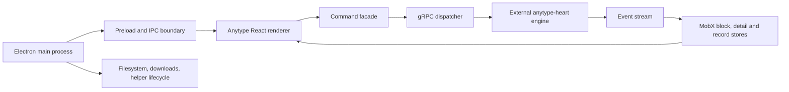

# Anytype source review: useful patterns for the writing workspace

Reviewed **September 30, 2026**. Portfolio baseline: `93ed628`. Anytype snapshot: **`92f871cf93d3ae59a0b7f74297aa7de72bf38301`**, `develop`, package **0.57.2-beta**, commit dated September 29, 2026.

**Recommendation:** keep Tiptap, the existing private draft model, and explicit GitHub publication. Borrow Anytype's configurable views, property-driven workflows, source navigation, search state discipline, and actionable failure states. Build an excellent research-to-publication workspace rather than reproducing its desktop knowledge operating system.

Implementation sequencing and acceptance criteria are in [the implementation plan](anytype-implementation-plan.md). This delivery is research and planning; it does not implement the proposed features.

## Scope and evidence

I cloned a source snapshot containing **7,051 tracked files**, including **2,037 TypeScript/TSX files**, **55 tracked test files**, and **367 TSX story files**. I mapped the major directories, inspected selected implementations and tests, scanned the latest **220 commit subjects** spanning August 20–September 29, read selected high-value patch diffs, and retrieved the latest eight release records. I also read the sole tracked dependency patch, `keytar+7.9.0.patch`.

This is not a claim that I read every source line, reviewed all historical commits, or ran every feature. Anytype was **not installed, built, or run**, and its tests were not executed. UI observations describe component code and flows, not a hands-on usability test. The 220-commit history window is narrower than the complete 0.57 release cycle. Upstream design documents were used as context and checked against implementation where cited; a proposal in a document alone is not evidence of a shipping feature.

The repository is the desktop client plus supporting browser/extension code. Core persistence, search indexing, synchronization, and encryption are delegated to **anytype-heart** and related services. Their implementation is outside this checkout and this review. A frontend command or type does not prove a backend guarantee. [Build boundary][A01], [command facade][A02], [dispatcher][A03].

Anytype uses the **Any Source Available License 1.0**, with use and redistribution conditions. Treat this as an architectural reference, not a permissively licensed component kit. The plan calls for independent implementations using our existing libraries; no Anytype implementation has been copied into application code. [License][A04].

## 1. The product model worth understanding

Anytype organizes work around objects rather than only pages. A page, file, bookmark, task, type definition, collection, or property definition can have identity and metadata. A type suggests structure and presentation; a relation is a typed property; a view selects and presents objects. The same object can appear in multiple views without becoming a duplicate page. [Object and relation types][A05], [view model][A06].

Three distinctions are especially useful for us:

| Concept | Meaning | Our equivalent or extension |
| --- | --- | --- |
| Identity | An object remains addressable when its label or location changes | We already have page IDs and block IDs. Preserve these across moves, views, and references. |
| Membership | An object belongs to a manually assembled collection | Our collection `include` list is a starting point; do not confuse this with folder ownership. |
| Query | Objects match a set of property conditions | Expand existing collection rules instead of creating another competing filtering system. |
| Presentation | Table/list/gallery/board/calendar display the selected objects | Existing editorial board and publication calendar are present, but not generic saved views. |
| Provenance | Where this object or excerpt originated | Extend source page/block references to captures and media, separate from current location. |

The opportunity is to make an article, its evidence, and its assets navigable as a coherent workspace. It is not necessary to make every object kind or every user-defined property public.

## 2. Architecture and code patterns

| Layer | Inspected implementation | What to learn | What not to transplant |
| --- | --- | --- | --- |
| UI | `component/editor`, `block`, `cell`, `menu`, `popup`, `widget` | Feature families separate editing, presentation, and reusable controls | Its large imperative components are not drop-in React/Tiptap extensions |
| Schema | `interface/object.ts`, `interface/block/*` | Explicit property kinds, view settings, selection and layout types | Numeric protocol enums should not become our persisted API accidentally |
| Models | `model/blockStructure.ts`, `view.ts`, `filter.ts` | Content, ordered structure, and presentation are distinct | A second durable block tree would compete with ProseMirror |
| Stores | `store/block.ts`, `detail.ts`, `record.ts` | Normalized IDs plus separate record ordering and detail caches | Global singleton stores are unnecessary for every local popover |
| Commands | `lib/api/command.ts` | UI intentions go through a named mutation boundary | Thousands of wrappers or gRPC are not needed for our REST/R2 backend |
| Events | `lib/api/dispatcher.ts` | Batch state changes; handle reconnect and hidden-window scheduling | Animation frames must never become the only persistence scheduler |
| Queries | `lib/util/subscription.ts`, `lib/dataview.ts` | Query identity includes context; sorted order and manual order have different owners | Do not blindly preserve optimistic positions in a server-sorted list |
| Desktop | `electron/ts/*` | Narrow trust boundaries and centralized file-job ownership | Electron IPC, OS keychain and native helper plumbing do not belong in a web admin |

### 2.1 Separate record identity, ordering, and fields

`RecordStore` has separate record, view, group, metadata, and lookup maps. A view can change its columns or sort without modifying every object. `BlockStructure` separately tracks parent and ordered child IDs. [Record store][A07], [block structure][A08].

**Adaptation:** a workspace view stores query and presentation settings. A page remains a single draft. A folder assignment, a parent/child relationship, a collection inclusion, and a reference edge remain different relationships. We already separate folders and hierarchy; preserve that separation as features expand.

### 2.2 Ordering is a policy, not just array movement

`applySubscriptionPosition` distinguishes manually ordered collections from explicitly sorted subscriptions. An optimistic insert may retain its manual position; a sorted subscription must accept the authoritative sort order. Board movement also updates the grouping property's value, rather than only moving a card on screen. [Subscription ordering][A09], [board mutations][A10].

**Adaptation:** enable drag reorder only in manual views. Dragging a card from Drafting to Review should update the editorial stage with the draft's expected version. Moving a review-date card should update that date; it must not silently schedule publication.

### 2.3 Commands, state updates, and rendering have different lifetimes

The dispatcher buffers events, applies updates through stores, and uses a timer fallback when animation frames do not run. Recovery state uses run IDs and monotonically ordered events; a gap triggers a snapshot refresh. Background observer scheduling is separate from store updates. [Dispatcher][A03], [recovery][A11], [reaction scheduler][A12].

**Adaptation:** keep autosave, upload progress, and publication receipts independent of panel visibility. If we eventually add live subscriptions, use sequence-aware snapshots. Do not add event-stream machinery just to replace the current small polling workflow.

### 2.4 Search is a navigation state machine

The search popup maintains filter tokens, a request generation, stable row identity, measurement generations, and snapshots used when drilling into a type/person/scope and returning. The pure `searchMatch` helpers separate policy from a very large UI component. [Search implementation][A13], [matching helpers][A14].

Our palette already debounces and aborts outdated requests. The missing opportunity is preserving **query + filters + active result + scroll** when visiting a result and returning, and making scope changes explicit. Use a reducer and typed result keys; do not port the huge popup or its global dependency graph.

### 2.5 Its editor solves a different synchronization problem

The main document editor has custom block text, mark ranges, focus handling, and cross-block selection; it is not a Tiptap editor. `VirtualBlock` materializes a trailing placeholder only when real input arrives and forks existing empty block identities to avoid conflicts in its particular whole-value text model. It defers swaps during IME composition. [Text and mark types][A15], [selection provider][A16], [virtual block][A17].

Borrow the invariants: do not persist presentation-only placeholders, do not discard IME input, map targets after edits, and treat pointer selection as a gesture with one owner. **Do not implement its identity-forking algorithm on top of our Tiptap/Yjs integration** without a demonstrated matching conflict model. We already have stable IDs, transaction-mapped interaction ownership, structured clipboard remapping, and recovery journals.

### 2.6 Feature examples and invariant tests complement each other

The checkout has broad Storybook examples and tests for isolated behavior: mark overlap, query matching, recovery event gaps, download reuse, history, subscription position, and trusted URLs. Story count is not coverage proof. Some tests require global mocks because production uses auto-imported globals—an example of coupling we should avoid. [Mark tests][A18], [recovery tests][A19], [trusted URL tests][A20].

For us: add visual fixtures for empty/loading/error/long-label states, plus a small number of browser journeys that cross components. The Edit/Page CSS collision we just fixed is precisely the kind of cross-feature regression isolated component screenshots can miss.

## 3. Feature inventory and comparison

“Present” means found in our current source, not freshly acceptance-tested during this audit. “Partial” identifies a narrower implementation. “Candidate” is an independent proposal, not a claim that Anytype implements our proposed version.

### Writing and block interactions

| Anytype capability | Our current state | Useful action |
| --- | --- | --- |
| Headings, lists, checklists, quotes, callouts, toggles | Present in Tiptap/slash registry | Improve round-trip and interaction coverage before adding duplicates. [A15] |
| Toggle headings | General details/toggle blocks present; exact heading-toggle behavior not established | Optional collapsible sections with correct outline treatment, after schema/render parity tests. [A15] |
| Inline color, background, marks, emoji | Color/font/opacity, highlight and emoji extensions present | Keep our existing appearance UI; test combinations and selection preservation. [A15] |
| Cross-block text selection and selected-block actions | Native ProseMirror text selection plus batch block tools/marquee | Test mixed inline atoms, nested lists, tables and scrolling gestures. [A16] |
| Local trailing placeholder materialization | Tiptap owns empty paragraphs | Adopt the no-phantom-content principle, not Anytype's CRDT workaround. [A17] |
| Page layout, cover, icon, display properties | Cover, icon, fonts, ligatures and headings present | Offer restrained page presets, not dozens of toolbar switches. [A05] |
| Image/file object with metadata and failure actions | Resizable images and media details; no unified failure inspector | High-value: broken-media card with Retry, Inspect and Replace. [A21] |
| Bookmark object and hover preview | Research URL captures and selected embeds exist | Promote useful captures into reusable source cards with origin and checked date. [A22] |
| Math and diagram embeds | Not in our editor node allowlist | Optional math/Mermaid with editor/public/export parity. [A23] |
| Many external embed processors | Selected social/video embeds only | Add providers only when required, through a constrained registry. [A24] |
| Mini-app and drawing processors | No equivalent | Defer arbitrary executable mini-apps; a schema-defined interactive block is safer. [A23] |
| Local undo/history and object history UI | Tiptap undo plus draft revisions present | Improve revision comparison/navigation rather than introduce another history store. [A25] |

### Organization and views

| Anytype capability | Our current state | Useful action |
| --- | --- | --- |
| Typed properties: text, number, date, select, multi-select, checkbox, object/file | Fixed page/editorial fields and research records | Start with optional writing-specific kinds and a bounded property schema. [A05] |
| Type/default-template combinations | Built-in templates plus user-saved research templates | Extend existing templates with default metadata and versioned provenance. [A06], [A26] |
| Query-backed sets and manually curated collections | Saved rule-based collections with manual inclusion present | Extend rather than build a parallel collections feature. [A06], [A09] |
| Multiple saved views of one collection | Fixed workspace board/calendar; collections show lists | Strong candidate: per-collection list/table/board/gallery settings. [A06] |
| AND/OR groups and relative date filters | Simple query/tag/status/pinned rules | Add a typed, bounded filter tree and readable chips. [A27] |
| Column visibility, width, wrapping, empty sort placement | Not a configurable page table | Useful for research-heavy collections, not the default writing screen. [A28] |
| Board grouping and drag mutation | Editorial board exists; no board drag handler found in inspected component | Add stage movement with version checks and keyboard alternative. [A10] |
| Calendar grouping and defaults when creating on a date | Publication calendar exists and directs schedule edits through Publish | Add a separate review calendar; keep publication an explicit action. [A29] |
| Timeline with start/end properties | No equivalent | Defer unless multi-week projects become common. [A30] |
| Graph view scoped by query/collection | Backlinks/outgoing references exist, no visual graph | Later: small evidence graph around one article, with a list equivalent. [A31] |
| Dashboard/sidebar widgets | Pinned/recent navigation and workspace tools exist | A compact “Needs attention” widget has more value than a widget builder. [A32] |

### Navigation, search and discovery

| Anytype capability | Our current state | Useful action |
| --- | --- | --- |
| Search filter tokens and context-sensitive suggestions | Phrase/word/status/tag/current-tree filters exist | Consolidate into chips with Clear and a stable query state. [A13], [A14] |
| Drill into a type/person/scope and Back to exact results | Result opening exists; full drill stack not found | Adapt to tags, folders, page kinds and collection scopes. [A13] |
| Recent result ordering and date sections | Recent-pages storage and navigator present | Add “recently opened” vs “recently edited” where meaningful. [A14] |
| “Created in” returns to block/property/message origin | Excerpts/reviews already retain page/block IDs | Extend provenance to captures/assets and centralize reveal behavior. [A33] |
| Open linked objects in context/preview | Page mention peek exists | Preserve source caret and scroll; add explicit “Open page” from peek. [A33] |
| Back/forward with history branch handling | Browser history and same-page navigation exist | Restore editor/search context; avoid a second conflicting router. [A34] |
| TOC highlight aligned with click destination | TOC exists; current reader uses a viewport threshold and scrollIntoView | High-value click-pinning and shared scroll-anchor contract. [A35] |
| OS-aware subtle scrollbars | Styled scroll regions exist | Keep visible on keyboard focus and where the platform expects them. [A36] |
| Native global shortcut/search window | Browser-local editable shortcuts exist | Do not promise system-wide shortcuts from an ordinary web page. [A37] |

### Reliability, portability and collaboration

| Anytype capability | Our current state | Useful action |
| --- | --- | --- |
| Download reuse verified by content | Upload deduplication already uses SHA-256 | Keep our canonical upload identity; learn job ownership, not desktop file paths. [A38] |
| Central download activity and per-file results | Durable upload jobs and progress exist | Unify actionable statuses across upload/import/export/publish, not every spinner. [A38] |
| Phased startup/recovery status | Save state, local recovery and session guard exist | Show actionable local/cloud/auth states; avoid an infinite undifferentiated spinner. [A11] |
| Notion/Obsidian/Markdown/HTML/text/CSV import entry points | Large internal-paste review; no full external import pipeline found | Start with bounded Markdown/HTML import into a chosen folder. [A39] |
| Export options and Success/Partial/Failed/Canceled report | Markdown publication and public Markdown endpoint; no workspace export report | Add private backup/export with attachment and unresolved-link reporting. [A40], [A41] |
| Any-Block v2 export | Explicitly labeled Preview in UI | Do not make this our interchange contract. [A40] |
| Chat, discussions, participants, notifications | Single-author admin plus private review notes | Keep private review annotations; full chat is low fit. [A05], [A42] |
| Optional AI-assisted import/model selection | No equivalent | Defer; deterministic import is more urgent. If added, show exactly what leaves the device. [A39] |
| Local API pairing, scoped grants and approval queue | Cloudflare Access-protected admin API | If integrations arrive, use narrow expiring grants; do not expose the admin session token. [A43] |
| Native helper, P2P sync and encrypted local data | R2 drafts, browser recovery, GitHub public snapshots | Not feature parity. These require a different infrastructure/security model. [A01], [A03] |
| Browser capture extension/native messaging | URL capture records exist; no browser extension | Later, a minimal capture form/extension with narrow authorization. [A44] |

## 4. Recent patches with direct lessons

These are selected reviewed diffs or source/history traces, not an assertion that every patch in the repository was audited. Links pin the change itself.

| Change | Mechanism / lesson | Application here |
| --- | --- | --- |
| [TOC click highlight, Sep 17](https://github.com/anyproto/anytype-ts/commit/c2fed09940350d4a45109554442871ac659b76f8) | Click scroll and active-heading calculation use the same anchor; pin clicked ID when multiple tail headings clamp to the same scroll position | Our reader needs the same end-of-document and no-scroll-event cases |
| [Broken-image actions, Sep 18](https://github.com/anyproto/anytype-ts/commit/76c559899efeb6daba334cd9ab102b8db5198597) | Real error DOM replaces CSS pseudo-content; recognize already-complete images with zero intrinsic width | Never trap users in a broken fullscreen image; preserve alt/width and expose repair |
| [Fast search reopen, Sep 15](https://github.com/anyproto/anytype-ts/commit/0c98ab6f42fabcbad1a6e994387e0ead8e9dcc34) | Closing animation and closed state differ; a delayed removal must not erase a newly reopened popup | Test rapid open–close–open across our Base UI surfaces before adding custom timers |
| [Checksum download reuse, Sep 15](https://github.com/anyproto/anytype-ts/commit/62d0e4e5d52c2db3759d4086457f39ac13ec7dff) | Reuse by verified content, not filename; expensive identity lookup is on demand | Validates our hashing direction; expose “existing image reused” feedback |
| [Origin navigation](https://github.com/anyproto/anytype-ts/commit/91a4e897) and [store fallback](https://github.com/anyproto/anytype-ts/commit/7cf377b7) | A partial list record may omit origin fields; resolve detail centrally and reveal in place when already open | Do not infer missing provenance from a summary row or unnecessarily reopen the current page |
| [Search cache/generation fixes](https://github.com/anyproto/anytype-ts/commit/3f62a900) and [drill restoration](https://github.com/anyproto/anytype-ts/commit/e2929ae6) | Identity-keyed measurement, stale-result guards, and complete navigation snapshots | Stronger search without swapping the backend immediately |
| [Slash list remeasurement](https://github.com/anyproto/anytype-ts/commit/0da8868f) | Initial scroll can shift again after virtual row measurement | Test long option lists after fonts/previews load, not only immediately on open |
| [CSS token collision](https://github.com/anyproto/anytype-ts/commit/eaf5ca86) | A generic `.token` class collided with Prism | Direct parallel to our `.view-switch` regression: namespace feature classes |
| [Mention search metadata](https://github.com/anyproto/anytype-ts/commit/4a2bf190) | Full highlighting payload is unnecessary for lightweight pickers | Page mentions need IDs/titles/icons, not full article excerpts |
| [Export result details](https://github.com/anyproto/anytype-ts/commit/8fb33df0) | Partial success is a first-class result with per-object diagnostics | Import/export jobs must distinguish usable output from complete success |
| [Renderer hardening, Sep 29](https://github.com/anyproto/anytype-ts/commit/6a331ab301d5db1a596b82ce4582168c5fcaedfe) | Trusted-navigation checks, sender checks and text/render boundaries | Keep our URL sanitization and private/public rendering boundaries; Electron rules are not web authorization |
| [AI import disclosure](https://github.com/anyproto/anytype-ts/commit/ec798f44) | Copy must match the actual route data takes | If AI is added, provider choice, payload and retention must be explicit |

The `patches/` directory contains one dependency patch: a keytar universal-binary build workaround. It has no useful feature transfer to our browser app. [Dependency patch][A45]. The 0.57.0 release notes and 0.57.2-beta notes provide a useful index, but beta/preview naming and implementation gates matter more than assuming every listed feature is stable. [0.57.0 release](https://github.com/anyproto/anytype-ts/releases/tag/v0.57.0), [0.57.2-beta release](https://github.com/anyproto/anytype-ts/releases/tag/v0.57.2-beta).

## 5. Highest-value things to build

The ratings are product judgments for this writing admin, not upstream performance claims. Effort is relative: S is a contained feature, M spans UI and storage, L introduces a new workflow or schema. Each needs the acceptance criteria in the companion plan.

| Rank | Proposal | Why it earns its place | Effort | Dependencies |
| --- | --- | --- | --- | --- |
| 1 | Shared TOC scroll/active-target behavior | Directly improves reading and removes a known class of UI mismatch | S | Existing Toc/Outline |
| 2 | Actionable media failures and reuse feedback | Protects writing momentum and makes storage behavior understandable | S–M | Existing media jobs/library |
| 3 | Search context restoration and removable scope chips | Lets research branch without losing the original query | M | Existing palette/index |
| 4 | Return-to-source for captures, excerpts and assets | Makes evidence traceable down to the relevant block | M | Existing block IDs/references |
| 5 | Per-collection saved views | Converts existing metadata into useful tools without duplicating pages | M–L | Versioned view schema |
| 6 | Interactive editorial board and review calendar | Makes current stage/review fields usable directly | M | Saved views, conflict-safe mutations |
| 7 | Templates with metadata defaults and provenance | Produces repeatable essay/review/release workflows | M | Existing template library |
| 8 | Small optional page-kind/property system | Enables Source, Essay, Note, Review workflows | L | Private metadata migration |
| 9 | Import preflight and detailed export/backup report | Makes portability honest and recoverable | L | Durable operation records, bounded parsers |
| 10 | Evidence health and “Needs attention” views | Surfaces stale excerpts, unresolved reviews, pending media | M | Provenance + existing fingerprints |
| 11 | Math/Mermaid and attachment cards | Valuable for technical writing; needs reliable public rendering | M–L | Node schema + serializers |
| 12 | Focused relation graph | Helps explore one article's sources, not a decorative global hairball | M | Existing reference index |

### Four creative adaptations

**Article evidence desk.** Open an article and see its sources, excerpts, and unresolved review notes together. Each source has “Open original”, “Show where used”, and “Compare with captured version”. Existing excerpt fingerprints mean this is an extension, not an AI fact-checker.

**Repair queue.** One saved view lists broken media detected during editing, missing targets, and unfinished uploads. Each row has the actual corrective action. Do not run unsolicited network link checks on every keystroke; external checks should be explicit, bounded and SSRF-safe.

**Review lens.** A view of pages whose review date has passed, or whose cited source snapshot changed. Stage and publication status remain separate. Resolving a review does not republish an article.

**Template lineage.** A page records which template version created it. If the template evolves, offer a preview of applicable structural changes; never silently overwrite the author's text. This is our proposal built from type/template/provenance ideas, not a verified Anytype feature.

## 6. UI rules for adapting these ideas

1. The editor remains centered on the document. Keep organization in the navigator/workspace and details in a secondary panel.
2. Use progressive disclosure: one view switch, one filter entry, one overflow menu. Do not recreate the maximalist toolbar the user asked us to remove.
3. Chips summarize active filters; suggestions only offer filters that can still be added. Reset is visible. A typed slash in a URL must not activate a command menu.
4. Preserve query, active row and scroll when opening a result; preserve caret when peeking at a source. A preview is not a second editor session by default.
5. Make failures useful: name the failed item and offer Retry, Inspect or Restore. A spinner without a meaningful state should time out into an explanation.
6. A moving board card changes one documented property. Read-only/sorted views do not pretend to support reorder.
7. Expose keyboard alternatives for drag/drop; use native scrolling and existing Base UI primitives. Keep focus restoration and reduced-motion behavior consistent.
8. Namespace styles (`media-view-toggle`, `workspace-view-tabs`, etc.) or use CSS modules. Shared appearance should come from tokens/components, not generic class selectors.
9. Preserve a list fallback for visual representations: graph, calendar and board should never be the sole route to a page.
10. Show provenance and internal workflow data only in admin unless an author explicitly includes it in published content.

## 7. Patterns to decline or defer

- **Full object-OS migration:** would replace persistence, indexing, permissions and publishing without a clear writing benefit.
- **Custom rich-text engine:** our ProseMirror transactions already solve selection/mark mapping. Replacing them with offset math recreates difficult edge cases.
- **Unrestricted formulas:** simple count/sum summaries may be useful; arbitrary evaluated code is not needed.
- **Native download ledger:** filesystem paths, mtimes and helper gateways have no direct browser equivalent. Our upload canonicalization remains server-owned.
- **P2P encryption claims:** IndexedDB recovery and Access authentication do not provide Anytype's encryption/sync model. Avoid implying equivalence.
- **Full chat/member administration:** high maintenance, low current fit for a single-author publishing workspace.
- **Mini-app HTML/JS blocks:** could turn content into executable admin code. Consider only a separately sandboxed, explicitly scoped product later.
- **Global MobX/auto-import migration:** would add another state framework and obscure dependencies. Borrow normalized data concepts, not the framework choice.
- **Everything virtualized:** useful for large search/media lists, risky inside rich text where browser selection needs mounted DOM. Measure before introducing it.
- **Unqualified source copying:** keep adaptations independent and track source references; upstream licensing is not the same as our dependency licenses.

## 8. Local comparison anchors

| Existing code | Why it matters to the plan |
| --- | --- |
| `cms/editor-document.ts`, `app/admin/ui/editor-interactions.ts` | Versioned structured draft checkpoint, block IDs, mapped selection ownership |
| `cms/research.ts`, `cms/server/research.ts` | Existing collections, templates, captures, excerpts, reviews and indexes |
| `app/admin/ui/ResearchWorkspace.tsx` | Existing editorial board, publication calendar and collection list—not absent features |
| `app/admin/ui/ResearchPanel.tsx` | Current evidence/reference workflows to extend |
| `cms/editorial.ts`, `app/admin/ui/DetailsSheet.tsx` | Stage and private UTC review date separate from publication |
| `app/admin/ui/SearchPalette.tsx`, `cms/search.ts` | Abort/debounce, phrase/word matching, filters and stable block destinations |
| `app/admin/ui/PageNavigator.tsx`, `PageTree.tsx`, `Folders.tsx` | Existing navigation, pins, recents, hierarchy, folder CRUD and drop targets |
| `app/admin/ui/MediaLibrary.tsx`, `MediaJobs.tsx`, `cms/server/media-dedup.ts` | Existing content deduplication, soft trash, metadata and durable upload jobs |
| `app/admin/ui/draft-journal.ts`, `SessionGuard.tsx`, `SaveState.tsx` | Existing recovery/auth-expiry/save-state foundations |
| `app/admin/ui/shortcuts.ts`, `cms/shortcuts.ts` | Existing editable keybindings; avoid a second keyboard registry |
| `app/components/writing/Toc.tsx`, `app/admin/ui/Outline.tsx` | Reader/editor heading navigation contracts |
| `cms/render.ts`, `cms/server/publish.ts`, `cms/published-fingerprint.ts` | Sanitization, explicit publication and publication identity |

## Source index

All file links below pin the reviewed Anytype snapshot. Source presence does not establish runtime availability or production quality. The plan's data contracts and effort estimates are our proposed adaptations.

Start with the [view model][A06], [search state][A13], [source navigation][A33], [TOC behavior][A35], and [export results][A41] for the highest-value implementation lessons. The remaining references support the feature comparison and architecture analysis above.

[A01]: https://github.com/anyproto/anytype-ts/blob/92f871cf93d3ae59a0b7f74297aa7de72bf38301/README.md
[A02]: https://github.com/anyproto/anytype-ts/blob/92f871cf93d3ae59a0b7f74297aa7de72bf38301/src/ts/lib/api/command.ts
[A03]: https://github.com/anyproto/anytype-ts/blob/92f871cf93d3ae59a0b7f74297aa7de72bf38301/src/ts/lib/api/dispatcher.ts
[A04]: https://github.com/anyproto/anytype-ts/blob/92f871cf93d3ae59a0b7f74297aa7de72bf38301/LICENSE.md
[A05]: https://github.com/anyproto/anytype-ts/blob/92f871cf93d3ae59a0b7f74297aa7de72bf38301/src/ts/interface/object.ts
[A06]: https://github.com/anyproto/anytype-ts/blob/92f871cf93d3ae59a0b7f74297aa7de72bf38301/src/ts/model/view.ts
[A07]: https://github.com/anyproto/anytype-ts/blob/92f871cf93d3ae59a0b7f74297aa7de72bf38301/src/ts/store/record.ts
[A08]: https://github.com/anyproto/anytype-ts/blob/92f871cf93d3ae59a0b7f74297aa7de72bf38301/src/ts/model/blockStructure.ts
[A09]: https://github.com/anyproto/anytype-ts/blob/92f871cf93d3ae59a0b7f74297aa7de72bf38301/src/ts/lib/util/subscription.ts
[A10]: https://github.com/anyproto/anytype-ts/blob/92f871cf93d3ae59a0b7f74297aa7de72bf38301/src/ts/component/block/dataview/view/board.tsx
[A11]: https://github.com/anyproto/anytype-ts/blob/92f871cf93d3ae59a0b7f74297aa7de72bf38301/src/ts/store/recovery.ts
[A12]: https://github.com/anyproto/anytype-ts/blob/92f871cf93d3ae59a0b7f74297aa7de72bf38301/src/ts/lib/reactionScheduler.ts
[A13]: https://github.com/anyproto/anytype-ts/blob/92f871cf93d3ae59a0b7f74297aa7de72bf38301/src/ts/component/popup/search.tsx
[A14]: https://github.com/anyproto/anytype-ts/blob/92f871cf93d3ae59a0b7f74297aa7de72bf38301/src/ts/lib/searchMatch.ts
[A15]: https://github.com/anyproto/anytype-ts/blob/92f871cf93d3ae59a0b7f74297aa7de72bf38301/src/ts/interface/block/text.ts
[A16]: https://github.com/anyproto/anytype-ts/blob/92f871cf93d3ae59a0b7f74297aa7de72bf38301/src/ts/component/selection/provider.tsx
[A17]: https://github.com/anyproto/anytype-ts/blob/92f871cf93d3ae59a0b7f74297aa7de72bf38301/src/ts/lib/virtualBlock.ts
[A18]: https://github.com/anyproto/anytype-ts/blob/92f871cf93d3ae59a0b7f74297aa7de72bf38301/src/ts/lib/mark.test.ts
[A19]: https://github.com/anyproto/anytype-ts/blob/92f871cf93d3ae59a0b7f74297aa7de72bf38301/src/ts/store/recovery.test.ts
[A20]: https://github.com/anyproto/anytype-ts/blob/92f871cf93d3ae59a0b7f74297aa7de72bf38301/electron/ts/lib/trustedUrl.test.ts
[A21]: https://github.com/anyproto/anytype-ts/blob/92f871cf93d3ae59a0b7f74297aa7de72bf38301/src/ts/component/block/media/image.tsx
[A22]: https://github.com/anyproto/anytype-ts/blob/92f871cf93d3ae59a0b7f74297aa7de72bf38301/src/ts/component/block/bookmark.tsx
[A23]: https://github.com/anyproto/anytype-ts/blob/92f871cf93d3ae59a0b7f74297aa7de72bf38301/src/ts/component/block/embed.tsx
[A24]: https://github.com/anyproto/anytype-ts/blob/92f871cf93d3ae59a0b7f74297aa7de72bf38301/src/ts/interface/block/embed.ts
[A25]: https://github.com/anyproto/anytype-ts/blob/92f871cf93d3ae59a0b7f74297aa7de72bf38301/src/ts/component/page/main/history.tsx
[A26]: https://github.com/anyproto/anytype-ts/blob/92f871cf93d3ae59a0b7f74297aa7de72bf38301/src/ts/lib/dataview.ts
[A27]: https://github.com/anyproto/anytype-ts/blob/92f871cf93d3ae59a0b7f74297aa7de72bf38301/src/ts/model/filter.ts
[A28]: https://github.com/anyproto/anytype-ts/blob/92f871cf93d3ae59a0b7f74297aa7de72bf38301/src/ts/interface/block/dataview.ts
[A29]: https://github.com/anyproto/anytype-ts/blob/92f871cf93d3ae59a0b7f74297aa7de72bf38301/src/ts/component/block/dataview/view/calendar.tsx
[A30]: https://github.com/anyproto/anytype-ts/blob/92f871cf93d3ae59a0b7f74297aa7de72bf38301/src/ts/component/block/dataview/view/timeline.tsx
[A31]: https://github.com/anyproto/anytype-ts/blob/92f871cf93d3ae59a0b7f74297aa7de72bf38301/src/ts/component/block/dataview/view/graph.tsx
[A32]: https://github.com/anyproto/anytype-ts/blob/92f871cf93d3ae59a0b7f74297aa7de72bf38301/src/ts/component/widget/index.tsx
[A33]: https://github.com/anyproto/anytype-ts/blob/92f871cf93d3ae59a0b7f74297aa7de72bf38301/src/ts/lib/util/object.ts
[A34]: https://github.com/anyproto/anytype-ts/blob/92f871cf93d3ae59a0b7f74297aa7de72bf38301/src/ts/lib/history.ts
[A35]: https://github.com/anyproto/anytype-ts/blob/92f871cf93d3ae59a0b7f74297aa7de72bf38301/src/ts/component/page/elements/tableOfContents.tsx
[A36]: https://github.com/anyproto/anytype-ts/blob/92f871cf93d3ae59a0b7f74297aa7de72bf38301/src/ts/component/util/stickyScrollbar.tsx
[A37]: https://github.com/anyproto/anytype-ts/blob/92f871cf93d3ae59a0b7f74297aa7de72bf38301/src/ts/component/page/main/quickSearch.tsx
[A38]: https://github.com/anyproto/anytype-ts/blob/92f871cf93d3ae59a0b7f74297aa7de72bf38301/electron/ts/download.ts
[A39]: https://github.com/anyproto/anytype-ts/blob/92f871cf93d3ae59a0b7f74297aa7de72bf38301/src/ts/component/page/main/settings/import/index.tsx
[A40]: https://github.com/anyproto/anytype-ts/blob/92f871cf93d3ae59a0b7f74297aa7de72bf38301/src/ts/component/popup/export.tsx
[A41]: https://github.com/anyproto/anytype-ts/blob/92f871cf93d3ae59a0b7f74297aa7de72bf38301/src/ts/lib/util/exportReport.ts
[A42]: https://github.com/anyproto/anytype-ts/blob/92f871cf93d3ae59a0b7f74297aa7de72bf38301/src/ts/component/comment/section.tsx
[A43]: https://github.com/anyproto/anytype-ts/blob/92f871cf93d3ae59a0b7f74297aa7de72bf38301/electron/ts/linkApproval.ts
[A44]: https://github.com/anyproto/anytype-ts/blob/92f871cf93d3ae59a0b7f74297aa7de72bf38301/extension/popup.tsx
[A45]: https://github.com/anyproto/anytype-ts/blob/92f871cf93d3ae59a0b7f74297aa7de72bf38301/patches/keytar+7.9.0.patch
