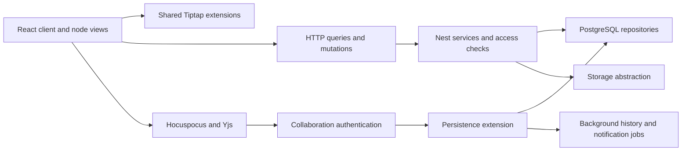

# Docmost source review and implementation plan

Reviewed September 30, 2026. Portfolio baseline: `184b8bc`. Docmost snapshot: **`b6434371ed5fe5aada45126cdf7fe3aae9b22fcf`**, main, package **0.96.0**.

**Recommendation:** keep our Tiptap editor, Cloudflare-protected private drafts, and explicit GitHub publication. Docmost is especially relevant because it also uses Tiptap 3.31.3. Borrow its separation of document schema from interactive views, contextual navigation, revision comparison, and permission-aware derived data. Its multi-tenant wiki infrastructure is not a prerequisite for a good single-author writing workspace.

## Scope and limitations

Inventoried 1,617 tracked entries, mapped client/server/editor-extension boundaries, scanned 150 commit subjects spanning May 13–September 30, 2026, and inspected selected editor, search, collaboration, permissions, attachment, history, import/export and transclusion code. Read selected recent diffs and the single tracked dependency patch. The checkout contains 40 paths matching test/spec filename patterns; that is an inventory, not a coverage score.

This is not an exhaustive review of every source line or historical patch. Docmost was not installed, built, or run. UI findings are based on component code. The server enterprise directory is a separate, uninitialized submodule; enterprise internals were not audited. Core is AGPL-3.0 and designated enterprise directories have different terms. Our implementation is independent code using our existing Tiptap/Base UI stack, not copied Docmost source. [README][D01], [enterprise license][D02], [submodule boundary][D03].

## 1. Architecture and structure

| Area | What the code does | Useful adaptation |
| --- | --- | --- |
| `apps/client/src/features` | Feature folders contain components, hooks, queries, services, types and state | Keep feature ownership clear; avoid growing Editor.tsx with every new workflow |
| `packages/editor-ext` | Schema, commands, parser/serializer and ProseMirror behavior reusable outside React | Keep display controls out of stored content; test editor/public/export parity |
| `apps/server/src/core` | Page, search, comment, share, space and attachment services | Centralize business decisions instead of relying on hidden controls |
| `apps/server/src/database/repos` | Data access separated from service orchestration | Our storage adapters should retain CAS/version semantics; SQL transactions do not translate to R2 |
| `apps/server/src/collaboration` | Authentication, Yjs loading/persistence, history jobs and synchronization | Distinguish connected, synchronized, persisted and published |
| `apps/server/src/integrations` | Import/export, storage, queues and environment concerns | File jobs need durable identity and explicit outcomes |
| Mantine / Jotai / TanStack Query | Component primitives, local shared state, remote-data cache | Borrow behavior; no need to replace our Base UI or add several state libraries |

### Document schema versus UI

Docmost registers shared extensions and then attaches React views for images, code, attachments, math and other blocks. The code-block view adds a language selector and a copy control around editable content. Those controls are not content nodes. [Extension registry][D04], [code view][D05].

**Implemented here:** a compact code toolbar using our existing AdminSelect and clipboard helper. Tiptap's existing schema, Markdown/HTML serialization and commands remain authoritative. Wrapping is local view state, not a new saved attribute. Unknown language identifiers from imported fences remain available rather than being silently reset.

This distinction should guide future PDF, diagram or citation blocks: define portable content first, attach UI second.

### Collaboration persistence is more than autosave

The persistence extension loads the existing Yjs document when available, otherwise transforms structured content into Yjs. It derives structured JSON/text, locks the page during a database transaction, and avoids redundant content writes using equality checks. History/contributor work is separate from rendering. The authentication extension verifies a collaboration-specific token and checks access/edit rights; readers and trashed pages can be read-only. [Persistence][D06], [collaboration authentication][D07].

Our application already has private structured checkpoints, conflict-aware saves, local recovery and a collaboration integration. Do not introduce Docmost's PostgreSQL/Redis/Hocuspocus stack just for parity. The transferable rule is that a socket connection does not prove durable save or public publication.

### Permission-aware derived data

Page access combines space-level ability with page restrictions. Backlinks filter related IDs by access; search also filters results before generating highlights. Counts, snippets, related pages and files can expose information even when the main document route is protected. [Access service][D08], [backlinks][D09], [search][D10].

Our present single-author Access boundary is simpler. If collaborators or private shares are introduced, every derived endpoint needs an explicit visibility policy. Hiding rows in React is insufficient.

### Transclusion is a relationship, not pasted HTML

Source blocks and references have identities; a server service synchronizes source definitions and referencing edges separately. Unlinking also has attachment-rewrite concerns. [Transclusion service][D11], [source node][D12], [reference node][D13].

We already store research excerpts, source block IDs and fingerprints. Start with **snapshot excerpts with an explicit Refresh action**, not automatically live public text. Publishing an article should pin referenced content to a reviewed version; a source edit must never change a live article accidentally.

### Search execution and navigation are separate

Docmost supports query plus labels/creator/space/title-only conditions and filter-only browsing. A recent optimization bounds queries and generates expensive highlights only for returned accessible results. Search-navigation UI then carries matched terms into the editor and cleans up highlights when closed. [Search][D10], [navigation dialog][D14].

We already have phrase/word search, tag/status/tree filters and a jump into find-in-page. Do not rebuild those. Improve exact-match targeting, restoring the original result list, and lightweight mention responses. Global search results and editor-local matches need a documented correspondence when text changes between indexing and opening.

## 2. Feature comparison

“Present” means found in our source; it does not mean revalidated in this review. Recommendations below are not all implemented.

| Docmost feature or nuance | Our current capability | Recommendation |
| --- | --- | --- |
| Code language picker and copy | Plain editable code blocks; public code copy already exists | **Implemented:** language, copy status, view-only wrap in admin |
| Mermaid preview inside code | No Mermaid editor node | Later, source-first diagram block with lazy renderer and public/export fallback |
| Math inline/block | No corresponding allowed nodes | Candidate for technical writing; require serialization and accessibility first |
| Footnotes with references | Research sources and page mentions, not a full footnote schema | High editorial value; add stable IDs, renumbering and backlink navigation together [D15] |
| Image/video/audio/PDF/file views | Image resizing, video/audio and media library present | PDF/attachment cards useful; preserve width/alt/caption on repair |
| Draw.io / Excalidraw | Not present | Defer heavyweight integrations until a real diagram-writing need |
| Columns and status blocks | Callouts/details present, no general columns/status schema | Optional status labels; columns need mobile linearization and accessible reading order |
| Table sorting in read-only mode | Tables present | Later, reader-only sort with original-order reset; never mutate author order [D16] |
| Pinned table headers and table controls | Existing Tiptap table support | Audit large-table keyboard/mobile behavior before adding controls |
| Subpage listing block | Hierarchy and navigator exist | A curated related-pages block is a better first public feature |
| Synced/transcluded blocks | Excerpts and source fingerprints | Start with explicit versioned refresh, defer automatic live synchronization |
| Inline comments/replies/resolution | Private review notes and references | Extend review anchors; full team notifications are not needed yet [D17] |
| Revision comparison and next/previous change | Revision UI exists | Add explicit version pair selection and change navigation [D18] |
| Tree drag/drop and fractional ordering | Hierarchy/folders/drop already exist | Preserve stable IDs and conflict-safe moves; do not duplicate folder semantics |
| Labels copied with page duplication | Tags already present | Include metadata in duplication fixtures; avoid copying publish state |
| Favorites | Pins and recents present | No additional subsystem |
| Search filters and match navigation | Mostly present | Improve continuity and stale-target behavior rather than another search interface |
| Per-page attachment browser | Global media library and usage data | Add a “Used on this page” lens using existing canonical asset IDs [D19] |
| Public spaces and shared subpages | Explicit published blog pages | Keep current publication contract; private descendants must not become public implicitly |
| Import task pipeline | Structured paste, no full external import workflow | Bounded Markdown/HTML preflight and per-item retry [D20] |
| Export with local links/assets | Markdown publication already present | Private backup with a manifest, pinned versions and partial-result report [D21] |
| Workspace roles/groups/session administration | Single-author Cloudflare Access | Defer until multi-author work is an actual requirement |
| AI/MCP/enterprise integrations | No equivalent | Separate licensed/enterprise boundaries; do not infer implementation from client menus |

## 3. UI flows worth adapting

### Research → writing

Search → open a passage → show exact match → navigate matches → return to the original query/filter/scroll state. A reader should not need to remember which search produced the open page. Our existing Jump/find contract is the starting point.

### Reuse → verify → publish

Choose an existing excerpt → show original page/block and capture date → insert a snapshot → mark changed source → compare and refresh explicitly → publish a reviewed snapshot. Deleted/inaccessible sources keep a useful explanation, not a broken empty block.

### Review a revision

Choose a revision → compare with previous or another chosen revision → show older/newer labels → jump among changes → restore as a new draft revision. The comparison helper resolves ordering from the revision list rather than selection order. We can adopt that behavior without copying its diff engine. [Comparison helper][D22].

### Technical writing

Insert code → choose language → edit source → wrap locally if the line is long → copy exact source → publish a conventional fenced block. The toolbar must remain keyboard-accessible and visible on touch, while preserving the caret and block identity.

| Before | After | Why |
| --- | --- | --- |
| Code is an unadorned editable region | Small, scoped toolbar above the source | Controls are discoverable without overlapping text |
| Fence language requires source-level editing | Existing Base UI select, including retained imported aliases | Reuses our design system and preserves imported data |
| Long lines require horizontal scrolling | Optional local Wrap toggle | Improves mobile editing without rewriting source |
| No dedicated editor code-copy control | Copy button confirms only successful copying | Avoids copying controls or falsely claiming clipboard success |
| Potential toolbar labels in custom serialization | Default code schema/serializers retained | Display UI cannot leak into published Markdown |

## 4. Recent changes and patch lessons

| Reviewed change / trace | Lesson for this app |
| --- | --- |
| [Details Markdown export](https://github.com/docmost/docmost/commit/b6434371ed5fe5aada45126cdf7fe3aae9b22fcf) | Nested formatting needs format-specific output, not just HTML that looks right in the editor |
| [Table header export](https://github.com/docmost/docmost/commit/f4caf0b) | Export fixtures should include real headers and headerless tables |
| [Duplicate labels](https://github.com/docmost/docmost/commit/a78e52b) | Duplication must define which metadata copies and which resets |
| [Search limits/performance](https://github.com/docmost/docmost/commit/870b71d) | Bound input and delay expensive snippet work until after result filtering |
| [Jump to search](https://github.com/docmost/docmost/commit/84e1e56) | Matched terms, highlight lifetime and navigation parameters belong to an explicit workflow |
| [Page tree reordering](https://github.com/docmost/docmost/commit/6205bbe) | Optimistic local order and websocket/cache updates must agree |
| [Local editor cache](https://github.com/docmost/docmost/commit/702f8b7) | Hook initialization/lifetime matters; editor updates and cached query content have separate timing |

The sole dependency patch changes SCIM no-target patch handling; it is identity-provider integration behavior, not a useful patch for our web editor. Do not apply it here. [SCIM patch][D23].

These are selected source/diff traces from the stated history window, not a claim to have audited every patch or certified security.

## 5. Implementation delivered in this change

- `app/admin/ui/extensions/code-block.tsx`: independent node view, common language choices, imported-language preservation, copy/error feedback, view-only wrapping.
- `app/admin/ui/Editor.tsx`: replace StarterKit's code-block registration with the extended version, keeping the same node name.
- `app/admin/admin-code.css`: scoped controls, stable copy button width, coarse-pointer targets, reduced-motion support.
- Directly declare the already-used Tiptap code-block package at 3.31.3; no Mantine/Docmost runtime added.
- Browser coverage exercises exact copied text, persisted language, retained unknown fences, wrapping, editing, clipboard denial, and structured checkpoint identity on desktop/mobile.

The reader already has syntax highlighting and code-copy controls. This batch changes the editing experience; it does not add live editor syntax highlighting or a Mermaid renderer.

## 6. Next implementation batches

| Priority | Deliverable | Implementation boundaries | Acceptance gate |
| --- | --- | --- | --- |
| 1 | Search return context and precise passage navigation | Extend SearchPalette/Jump/Find; retain query, filters, active key and scroll | Repeated phrases, changed/deleted blocks, close/reopen and back navigation |
| 2 | Used-on-this-page media view | Reuse canonical asset identity and reference index | Shared media, deleted blocks, draft/live differences; no duplicate upload |
| 3 | Revision comparison navigation | Extend Revisions UI, explicit older/newer pair, next/previous change | Same revision, missing revision, long content, restore conflict |
| 4 | Footnotes | Versioned node/mark, ID remapping, public anchors, Markdown parser/serializer | Reorder, duplicate, copy/paste, deleted note, public/export round trip |
| 5 | Reusable excerpt snapshots | Extend research records with origin/version and explicit refresh | Source change, missing source, no automatic publication |
| 6 | Export/import manifest | Bounded parsers, stable item IDs, safe asset paths, explicit partial results | Retry does not duplicate, cancellation, unsupported nodes, round-trip fidelity |
| 7 | Mermaid/math or attachment cards | Lazy renderer, safe source, accessible fallback, editor/public/export parity | Failed render remains editable; no private data sent to external renderers |

Do not mix these into a single migration. Reuse the Anytype plan's search/provenance/import foundations. The source editor, private metadata and published article must remain distinct.

## 7. What not to import

- A second rich-text engine or a second schema owner: both projects already demonstrate Tiptap can support these interactions.
- Mantine/Jotai/TanStack wholesale: solve a measured problem before adding overlapping frameworks.
- PostgreSQL/Redis/background-worker infrastructure solely to imitate a wiki architecture.
- Live transclusions into published pages without version pinning and explicit publication.
- Enterprise authorization/AI source or SCIM patches as generic utilities.
- Full-page virtualization that unmounts editable selection ranges.
- Claims that a source review proves production security, runtime usability, or full feature parity.

## Verification

- All 78 unit tests passed.
- Four new browser cases passed: persistence/source fidelity and clipboard failure, each on desktop and mobile Chromium.
- Existing image-size/reader-preview cases passed on desktop and mobile; the desktop Turn into submenu case passed. Its existing mobile skip remains.
- Desktop/mobile screenshots were inspected. Browser emulation is not a physical-device or IME audit.
- ESLint and TypeScript checks passed.
- Production build and static export passed; existing warnings remain in unrelated files.

The recommendation list is a roadmap, not a claim that all those features shipped in this change.

## Sources

All file links pin the reviewed commit. Current library documentation was fetched through Context7 for React node-view integration; the installed Tiptap source was also checked for inherited Markdown behavior.

[D01]: https://github.com/docmost/docmost/blob/b6434371ed5fe5aada45126cdf7fe3aae9b22fcf/README.md
[D02]: https://github.com/docmost/docmost/blob/b6434371ed5fe5aada45126cdf7fe3aae9b22fcf/packages/ee/LICENSE
[D03]: https://github.com/docmost/docmost/blob/b6434371ed5fe5aada45126cdf7fe3aae9b22fcf/.gitmodules
[D04]: https://github.com/docmost/docmost/blob/b6434371ed5fe5aada45126cdf7fe3aae9b22fcf/apps/client/src/features/editor/extensions/extensions.ts
[D05]: https://github.com/docmost/docmost/blob/b6434371ed5fe5aada45126cdf7fe3aae9b22fcf/apps/client/src/features/editor/components/code-block/code-block-view.tsx
[D06]: https://github.com/docmost/docmost/blob/b6434371ed5fe5aada45126cdf7fe3aae9b22fcf/apps/server/src/collaboration/extensions/persistence.extension.ts
[D07]: https://github.com/docmost/docmost/blob/b6434371ed5fe5aada45126cdf7fe3aae9b22fcf/apps/server/src/collaboration/extensions/authentication.extension.ts
[D08]: https://github.com/docmost/docmost/blob/b6434371ed5fe5aada45126cdf7fe3aae9b22fcf/apps/server/src/core/page/page-access/page-access.service.ts
[D09]: https://github.com/docmost/docmost/blob/b6434371ed5fe5aada45126cdf7fe3aae9b22fcf/apps/server/src/core/page/services/backlink.service.ts
[D10]: https://github.com/docmost/docmost/blob/b6434371ed5fe5aada45126cdf7fe3aae9b22fcf/apps/server/src/core/search/search.service.ts
[D11]: https://github.com/docmost/docmost/blob/b6434371ed5fe5aada45126cdf7fe3aae9b22fcf/apps/server/src/core/page/transclusion/transclusion.service.ts
[D12]: https://github.com/docmost/docmost/blob/b6434371ed5fe5aada45126cdf7fe3aae9b22fcf/packages/editor-ext/src/lib/transclusion/transclusion-source.ts
[D13]: https://github.com/docmost/docmost/blob/b6434371ed5fe5aada45126cdf7fe3aae9b22fcf/packages/editor-ext/src/lib/transclusion/transclusion-reference.ts
[D14]: https://github.com/docmost/docmost/blob/b6434371ed5fe5aada45126cdf7fe3aae9b22fcf/apps/client/src/features/editor/components/search-and-replace/search-navigation-dialog.tsx
[D15]: https://github.com/docmost/docmost/blob/b6434371ed5fe5aada45126cdf7fe3aae9b22fcf/packages/editor-ext/src/lib/footnotes/reference.ts
[D16]: https://github.com/docmost/docmost/blob/b6434371ed5fe5aada45126cdf7fe3aae9b22fcf/packages/editor-ext/src/lib/table/table-readonly-sort.ts
[D17]: https://github.com/docmost/docmost/blob/b6434371ed5fe5aada45126cdf7fe3aae9b22fcf/apps/server/src/core/comment/comment.service.ts
[D18]: https://github.com/docmost/docmost/blob/b6434371ed5fe5aada45126cdf7fe3aae9b22fcf/apps/client/src/features/page-history/components/history-modal-body.tsx
[D19]: https://github.com/docmost/docmost/blob/b6434371ed5fe5aada45126cdf7fe3aae9b22fcf/apps/server/src/core/attachment/services/attachment.service.ts
[D20]: https://github.com/docmost/docmost/blob/b6434371ed5fe5aada45126cdf7fe3aae9b22fcf/apps/server/src/integrations/import/services/file-import-task.service.ts
[D21]: https://github.com/docmost/docmost/blob/b6434371ed5fe5aada45126cdf7fe3aae9b22fcf/apps/server/src/integrations/export/export.service.ts
[D22]: https://github.com/docmost/docmost/blob/b6434371ed5fe5aada45126cdf7fe3aae9b22fcf/apps/client/src/features/page-history/utils/resolve-compare-pair.ts
[D23]: https://github.com/docmost/docmost/blob/b6434371ed5fe5aada45126cdf7fe3aae9b22fcf/patches/scimmy@1.3.5.patch
